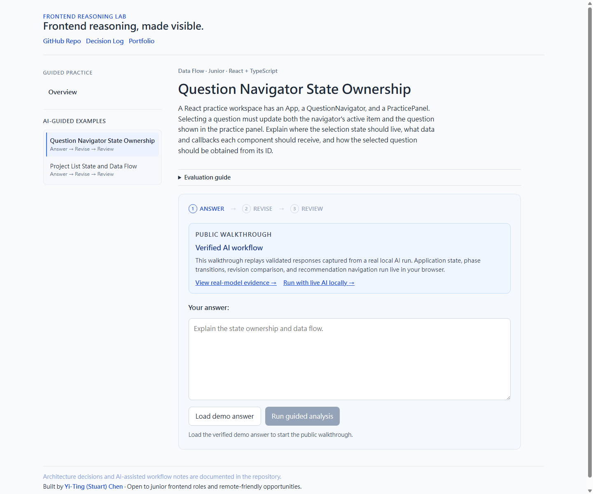

# Frontend Reasoning Lab

> **Release line:** `v0.3.0` established the FRL v3 guided workflow, and
> `v0.3.1` added the public interactive walkthrough. The current `v0.3.2`
> release improves LM Studio compatibility for newer Qwen chat templates.

Frontend Reasoning Lab is a bounded React + TypeScript reference workflow for
using architecture-constrained AI to diagnose and improve frontend reasoning.

The application owns the workflow, legal state transitions, validation
boundaries, and rendering. AI supplies structured evaluation results inside
those constraints. FRL is intentionally a demonstrative engineering project,
not a course platform or general-purpose question bank.

> Small scope, clear engineering signal.

## Live Demo

[Open the Public Interactive Walkthrough](https://frontend-reasoning-lab.netlify.app/)

The public build replays validated responses captured from a real local model
run. The reducer, phase transitions, revision comparison, recommendation
navigation, and session reset still run live in the browser; only model
inference is replayed.

- [View real-model browser evidence](./docs/v3/evidence/README.md)
- [Run the same workflow with live AI locally](#run-with-live-ai-locally)

## Contents

- [What FRL Demonstrates](#what-frl-demonstrates)
- [Guided Workflow](#guided-workflow)
- [Two Execution Modes, One Application Contract](#two-execution-modes-one-application-contract)
- [State and Data Flow](#state-and-data-flow)
- [Core Engineering Decisions](#core-engineering-decisions)
- [Scope Control](#scope-control)
- [Run with Live AI Locally](#run-with-live-ai-locally)
- [Verification](#verification)
- [Project History and Documentation](#project-history-and-documentation)

## Preview



## What FRL Demonstrates

- **Architecture-constrained AI** — the model interprets an answer inside
  question-defined contracts; it does not own application state or grading
  rules.
- **Explicit workflow state** — Answer → Revise → Review is represented by
  legal reducer transitions rather than incidental UI booleans.
- **Validated model output** — structural parsing and semantic validation run
  before live model results enter the application workflow.
- **Execution-source independence** — local live inference and public replay
  satisfy the same application-facing adapter contract.
- **Evidence-backed presentation** — the public walkthrough identifies what is
  replayed, what still runs live, and where the real-model evidence is stored.

## Guided Workflow

```txt
choose a guided frontend example
→ explain the reasoning
→ receive one focused diagnosis
→ revise the answer
→ compare what improved
→ continue to one bounded recommended question
```

The workflow is deliberately narrow. It demonstrates how frontend architecture
can constrain AI evaluation without expanding FRL into a full education
platform.

## Two Execution Modes, One Application Contract

| Context | Evaluation source | Input boundary |
| --- | --- | --- |
| Public production | Validated Call 1 and Call 2 responses captured from a real local model run | Verified demo answer and revision only |
| Local development | Live LM Studio or OpenAI inference through server-owned HTTP adapters | Arbitrary answers and revisions |

Both modes feed validated domain results into the same session workflow. The
application still owns phase transitions, retry/edit actions, revision
comparison, recommendation navigation, and fresh-session reset.

The public walkthrough does not evaluate edited text with fixed feedback. If a
verified input is changed, the UI requires a reset before replay can continue.
This keeps the relationship between input and feedback honest without exposing
credentials or consuming a public model budget.

## State and Data Flow

The v3 flow keeps selection, session state, model execution, and rendering as
separate responsibilities:

```txt
QuestionNavigator emits a selection intent
→ App updates SelectedContent and starts a fresh practice session
→ V3PracticeWorkspace emits answer or revision actions
→ usePracticeSession calls the configured evaluation adapter
→ the session reducer accepts a validated domain result
→ React renders the next legal phase
```

Changing questions invalidates pending work before a new session begins, so an
older result cannot update the newly selected question.

The application-facing boundary is stable across both execution modes:

```ts
type PracticeEvaluationAdapter = {
  diagnose(
    input: DiagnosePracticeAnswerInput,
  ): Promise<InitialDiagnosisResult>;
  compareRevision(
    input: ComparePracticeRevisionInput,
  ): Promise<RevisionComparisonResult>;
};
```

## Component Responsibilities

### App

The application root owns selected content, derives the active guided question,
starts a fresh session when selection changes, and connects recommendation
navigation back to the same controlled selection path.

### QuestionNavigator

The navigator renders Overview and the bounded AI-guided examples. It receives
the current selection and emits one `SelectedContent` intent; it does not own
session or phase state.

### OverviewPanel

The Overview explains the constrained workflow, the evaluation boundary, and
the distinction between public replay and local live inference.

### Practice session

`usePracticeSession` coordinates async evaluation with the reducer. The reducer
owns legal Answer → Revise → Review transitions and browser-safe failure states.

### Evaluation composition

The composition selects the HTTP adapter in development and the public
walkthrough adapter in production. Neither adapter renders UI or owns React
state.

## Core Engineering Decisions

### Parent-Owned Selection State

Overview and Question selection affect the same main content area, answer state, and evaluator lifecycle.

For that reason, the selection is owned by the nearest common parent rather than stored inside the navigator.

### Unified Selection Intent

The navigator emits a `SelectedContent` value instead of separate callbacks such as:

```txt
onSelectOverview
onSelectQuestion
```

This gives the parent one consistent event boundary while preserving explicit content variants through a discriminated union.

### Derived Guided Question

The application stores the selected content identity and derives the
corresponding v3 question from the guided-question registry.

This keeps the question data as the source of truth and avoids duplicated state.

### Session and stale-response protection

Changing the current question starts a new session. Async completion actions
carry the session identity and are ignored when they no longer belong to the
active session.

This prevents an older async result from appearing under a different question after the user navigates away.

### Validated evaluation boundary

The model cannot write directly to React state:

```txt
model output
→ structural parsing
→ semantic validation
→ versioned safe result
→ application adapter
→ session reducer
```

The public replay adapter demonstrates that the application depends on the
validated result contract, not on one specific model runtime.

## Scope Control

FRL v3 intentionally does not include:

- authentication
- backend persistence
- user accounts
- practice history
- analytics dashboard
- complex routing
- admin tools
- payments
- a large design system
- an open-ended public AI endpoint
- a general-purpose question bank UI
- a full education platform

The goal is to demonstrate one coherent AI-assisted reasoning workflow whose
state, contracts, failure handling, and execution boundaries can be inspected
and explained clearly.

## AI-Assisted Engineering Workflow

AI was used to support:

- planning bounded implementation slices
- generating small implementation proposals
- reviewing state and component boundaries
- checking edge cases
- improving documentation
- validating whether changes stayed inside scope

The project scope, state model, component responsibilities, trade-offs,
verification criteria, and final implementation decisions were reviewed and
owned by me.

AI assistance is treated as part of the engineering workflow, not as a substitute for understanding or responsibility.

Versioned decision and verification records remain under [`docs/`](./docs/).

## Tech Stack

- React
- TypeScript
- Vite
- CSS

## Run with Live AI Locally

The public deployment provides an interactive walkthrough using captured,
validated responses from a real local model run. To evaluate arbitrary answers
with a live model:

1. Clone the repository and install its dependencies:

   ```bash
   git clone https://github.com/stuartchendev/frontend-reasoning-lab.git
   cd frontend-reasoning-lab
   npm install
   ```

2. Copy the committed environment template to a local `.env` file:

   ```bash
   cp .env.example .env
   ```

3. Configure either [LM Studio](#local-lm-studio-setup) or
   [OpenAI](#openai-runtime-and-verification) in `.env`. Keep this file
   uncommitted.
4. Start the Vite development server with Netlify Functions enabled:

   ```bash
   npm run dev:netlify
   ```

The browser does not own or modify runtime configuration and never receives
provider credentials. The provider-specific details below remain the source of
truth for local configuration.

## Local LM Studio Setup

Start LM Studio, load the model you want to use, and start its local
OpenAI-compatible server. In `.env`, keep the loopback base URL and replace the
model placeholder with the exact identifier reported by LM Studio:

```env
LM_STUDIO_BASE_URL=http://127.0.0.1:1234/v1
LM_STUDIO_MODEL=your-loaded-model-identifier
LM_STUDIO_TIMEOUT_MS=25000
```

Open the local URL printed by Vite. The development-only **AI Runtime** panel
reports the selected provider and model. For LM Studio it also reports the
configured endpoint and can refresh its `Connected` or `Unavailable` status.

The settings are read by the server runtime when development starts. Restart
`npm run dev:netlify` after changing `.env`. Do not rename these variables with
a `VITE_` prefix: credentials and model runtime configuration must remain
server-owned. The status panel and status endpoint are unavailable in
production. `LM_STUDIO_TIMEOUT_MS` is optional and accepts a positive integer
number of milliseconds. It defaults to 25 seconds when missing or invalid and
controls only the LM Studio client request timeout; it does not extend the
surrounding Netlify synchronous Function execution limit. The browser live-AI
flow currently passes through a Netlify Function, whose synchronous execution
limit is 60 seconds. A slow local model can therefore succeed when invoked
directly through the LM Studio pipeline but fail to return through the browser
UI when inference approaches or exceeds that window. Setting
`LM_STUDIO_TIMEOUT_MS` above 60 seconds does not remove the Function limit. For
browser-based local testing, choose a model that can reliably complete each of
the two evaluation calls within the available execution window. The separate
OpenAI client timeout remains 45 seconds.

## OpenAI Runtime and Verification

The same two-call v3 evaluation path can use the OpenAI Responses API. Provider
selection remains server-owned:

- Complete, non-blank `LM_STUDIO_BASE_URL` and `LM_STUDIO_MODEL` settings select
  LM Studio. When complete LM Studio settings and `OPENAI_API_KEY` are both
  present, LM Studio has explicit precedence.
- A partial or blank LM Studio pair is a configuration error and never silently
  falls through to OpenAI.
- If neither LM Studio variable is defined, the Functions select OpenAI and
  require a non-blank `OPENAI_API_KEY`.

For local OpenAI verification, create a local `.env` that contains the
server-only key and does not contain either `LM_STUDIO_*` variable:

```env
OPENAI_API_KEY=replace-with-your-local-secret
```

Never add the key to a `VITE_*` variable, committed file, browser code, or test
fixture. Start the local Netlify runtime with `npm run dev:netlify`, then follow
the normal diagnosis and revision-review flow in the browser. `OPENAI_API_KEY`
is the only OpenAI environment setting currently read by FRL; the model and
request timeout remain fixed in the server-side clients.

In local development, the **AI Runtime** panel uses the same provider resolver
as Call 1 and Call 2. OpenAI-only configuration displays `Provider: OpenAI`,
model `gpt-5.6-luna`, and `Configured`. This is a configuration status only: the
panel does not call the OpenAI API or verify credentials/model access, so it
does not produce completion tokens or provider fees.

### Hosted deployment boundary

The local `.env` file and Netlify site environment variables are independent
configuration boundaries. `.env` must remain uncommitted and is not
automatically deployed to Netlify.

The public deployment does not require `OPENAI_API_KEY`. It composes the
existing application workflow with a deterministic replay adapter whose Call 1
and Call 2 results were captured from a real local model run and passed through
the existing structural and semantic validation pipelines. The reducer, phase
transitions, revision flow, comparison, recommendation navigation, and new
session reset still run live in the browser; only model inference is replayed.

The walkthrough accepts only the verified demo answer and revision. Editing
either input requires resetting it before replay can continue, so fixed
feedback is never presented as an evaluation of arbitrary text. The public UI
links to the real-model browser evidence and this local live-AI setup. It does
not claim a hosted production model E2E, expose runtime configuration, or
require a committed `.env` file.

Both OpenAI clients use a 45-second request timeout, below Netlify's 60-second
synchronous Function limit, so FRL retains time to validate model output and
return a versioned safe envelope. SDK retries remain disabled with
`maxRetries: 0`; each learner submission performs at most one model call.
Provider rate limits map to `rate-limited`, transport/timeout failures map to
`model-unavailable`, and malformed structured responses map to
`invalid-model-output`.

The focused OpenAI reliability path does not require a real API key:

```bash
node --test \
  tests/openaiDiagnosisClient.test.mjs \
  tests/openaiRevisionReviewClient.test.mjs \
  tests/openaiReliabilityHttp.test.mjs
```

These tests use injected fake transports while exercising the real OpenAI
request boundary, server pipeline, semantic validation, HTTP status mapping,
safe envelopes, and trace IDs for Call 1 and Call 2. A successful automated run
is not evidence of a live OpenAI or browser E2E. A future public live-model deployment would still require minimum rate limiting and usage protection.

### OpenAI live two-call HTTP smoke

The live HTTP smoke setup covers the actual local Netlify Function endpoints:

```txt
reference initial answer
→ diagnose-initial-answer
→ validated needs-follow-up diagnosis
→ reference revised answer
→ review-revised-answer
→ validated revision comparison
```

This setup is complete, but it is separate from the fake-transport tests above
and does not count as a passed live run until it is executed with a real
`OPENAI_API_KEY`. It does not execute the browser service, HTTP adapter, hook,
reducer, or UI. The resulting `complete / revision-reviewed` reducer state is
recorded only as an architectural expectation, not as live browser evidence.

When using WSL, confirm that both `node` and `npm` resolve to the Linux/WSL-native
Node 24 toolchain before running the commands below:

```bash
command -v node
command -v npm
node -v
npm -v
```

Prepare a local `.env` with only the OpenAI key, then build and start the local
Netlify runtime:

```bash
npm run build
npm run dev:netlify
```

In a second terminal, run:

```bash
npm run smoke:openai-live
```

The command loads `.env` when present, uses `OPENAI_LIVE_SMOKE_BASE_URL` when
provided, otherwise defaults to `http://127.0.0.1:5173`, and refuses to send a
model request when:

- `OPENAI_API_KEY` is missing
- either `LM_STUDIO_BASE_URL` or `LM_STUDIO_MODEL` is defined
- the running Netlify server cannot be reached or its provider state cannot be
  verified
- the target is not a loopback HTTP origin
- the production bundle contains the exact runtime key or the server-only
  `OPENAI_API_KEY` marker

A passed live HTTP smoke requires exactly HTTP 200 and valid version `"1"`
success envelopes for both calls, a `needs-follow-up` Call 1 result, and a valid
Call 2 resolution. The expected reducer outcome is not part of the live pass
criteria. A passed command writes redacted machine-readable JSON and
human-readable Markdown under:

```txt
tmp/openai-live-smoke/<timestamp>/
```

To save the evidence somewhere else:

```bash
npm run smoke:openai-live -- --output-dir /absolute/safe/evidence/path
```

The command refuses to overwrite an existing output directory. It writes both
evidence files into a fresh staging directory and publishes that directory only
after both writes succeed, so failed or not-run commands do not publish new
passed evidence in the requested final location.

The evidence records HTTP status, contract version, result kind, trace ID,
model latency, nullable token usage, `browserExecutionStatus: "not-run"`, the
architectural `expectedReducerOutcome`, and the bundle safety result. It does
not store the API key, raw provider details, prompts, learner answers, or full
model output. Keep generated evidence out of Git until it has been reviewed for
the intended audience.

The setup slice itself does not use a real API key, so its honest status is:

```txt
setup: complete
fake-transport tests: separate
live execution: not run
live execution passed: not claimed
browser execution: not run
```

## Verification

The v3 workflow is covered by:

- reducer and selector tests for legal phase transitions
- adapter composition tests for development and production execution modes
- public walkthrough tests for verified-input enforcement and replayed results
- structural and semantic validation tests for both model calls
- stale session/request protection checks
- TypeScript typecheck and production build
- responsive browser review of Overview and Answer → Revise → Review
- same-session local real-model browser evidence
- production-bundle checks for server-only runtime markers and credentials

The evidence record distinguishes automated tests, local HTTP smoke checks,
real-model browser execution, and hosted production verification rather than
treating them as interchangeable proof.

## Key Takeaway

Frontend Reasoning Lab demonstrates how a bounded application architecture can
use AI without handing the model ownership of the product workflow:

- React owns selection, session state, and rendering
- the reducer owns legal transitions
- adapters isolate the execution source
- validators protect the domain boundary
- correlated requests prevent stale updates
- public replay and local live inference remain explicit
- evidence and claims stay scoped to what was actually verified

The project stays small enough to explain clearly while still showing
meaningful React, TypeScript, async-state, and AI-boundary decisions.

## Project History and Documentation

FRL evolved through bounded, reviewable slices rather than by turning the
original evaluator proof into a broad platform:

- **v1** established one controlled deterministic reasoning loop.
- **v2 Mini** added the frontend workspace, parent-owned selection, derived
  question data, and stale-result protection.
- **v3** added the typed Answer → Revise → Review session, two validated model
  calls, recommendation navigation, local provider composition, and the public
  interactive walkthrough.

Reviewer entry points:

- [`docs/v3/ARCHITECTURE_DECISIONS.md`](./docs/v3/ARCHITECTURE_DECISIONS.md) —
  v3 ownership, contract, and session decisions
- [`docs/v3/evidence/README.md`](./docs/v3/evidence/README.md) — local real-model
  Answer → Revise → Review → recommended-question browser evidence
- [`docs/v2/FRL_V2_DECISIONS.md`](./docs/v2/FRL_V2_DECISIONS.md) — retained v2
  frontend foundation and historical implementation decisions
- [`docs/frl-core-concepts.svg`](./docs/frl-core-concepts.svg) — reasoning model
  shared across FRL versions
- [`docs/EVALUATOR_RUBRIC.md`](./docs/EVALUATOR_RUBRIC.md) — shared evaluator
  criteria and responsibility boundary
- [`docs/v1/FRL_V1_DECISIONS.md`](./docs/v1/FRL_V1_DECISIONS.md) — frozen v1
  decision evidence
