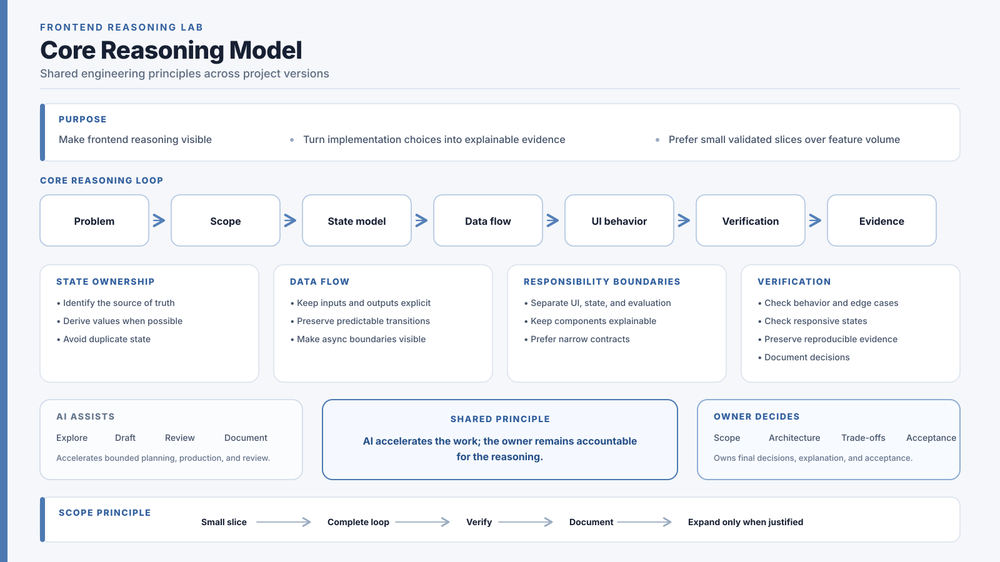

# Frontend Reasoning Lab Documentation

This directory separates shared project references from version-specific evidence.

## Current Release Path

FRL v1 is the version currently deployed to production. FRL v2 Mini is implemented on the `FRLv2` development/release branch and is being prepared for a version-level merge into `main`.

For the current v2 implementation, read:

1. [`v2/FRL_V2_DECISIONS.md`](./v2/FRL_V2_DECISIONS.md) — current engineering decisions and implemented scope
2. [`v2/VERIFICATION.md`](./v2/VERIFICATION.md) — v2 interaction, responsive, and engineering verification
3. [`v2/FRL_V2_MINI_SCOPE_V0_1.md`](./v2/FRL_V2_MINI_SCOPE_V0_1.md) — historical v0.1 planning context; not the current scope source of truth

For the current release status, see [`CURRENT_STATUS.md`](./CURRENT_STATUS.md).

## Shared Reference

The core reasoning model summarizes the project principles that remain shared across versions: explicit state ownership, predictable data flow, responsibility boundaries, verification, scope control, and owner accountability in AI-assisted work.

- [`frl-core-concepts.svg`](./frl-core-concepts.svg) — cross-version reasoning model
- [`EVALUATOR_RUBRIC.md`](./EVALUATOR_RUBRIC.md) — shared evaluator rubric and boundary

## Historical v1 Evidence

The following files describe the completed and frozen v1 tiny proof:

- [`v1/FRL_V1_DECISIONS.md`](./v1/FRL_V1_DECISIONS.md)
- [`v1/TINY_PROOF.md`](./v1/TINY_PROOF.md)
- [`v1/VERIFICATION.md`](./v1/VERIFICATION.md)

## Archived and Future Context

The following planning documents are retained for historical context:

- [`archive/FUTURE_MVP_SCOPE.md`](./archive/FUTURE_MVP_SCOPE.md)
- [`archive/FUTURE_ARCHITECTURE_NOTES.md`](./archive/FUTURE_ARCHITECTURE_NOTES.md)
- [`archive/ARCHIVED_AI_COLLAB_CONTEXT.md`](./archive/ARCHIVED_AI_COLLAB_CONTEXT.md)

They do not override [`CURRENT_STATUS.md`](./CURRENT_STATUS.md) or the current v2 decisions.
