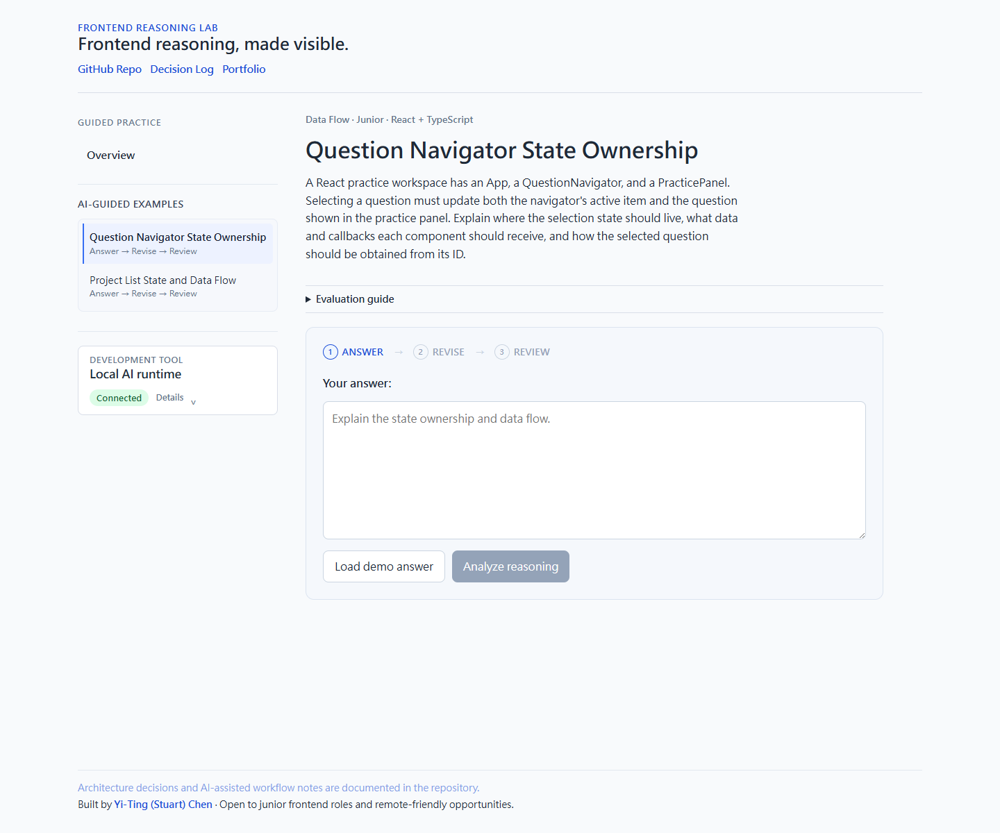
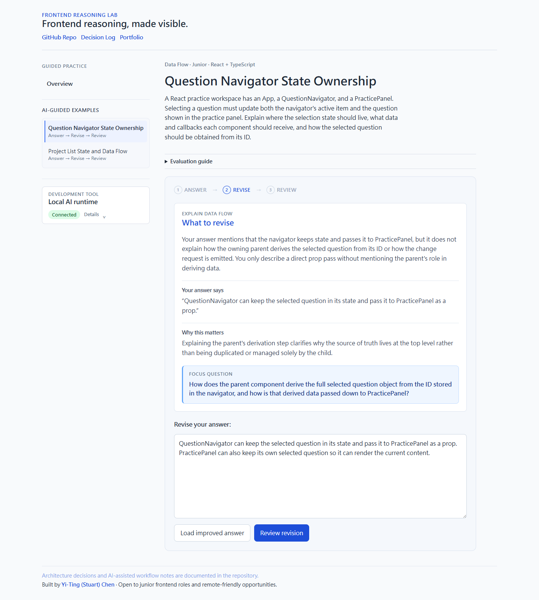
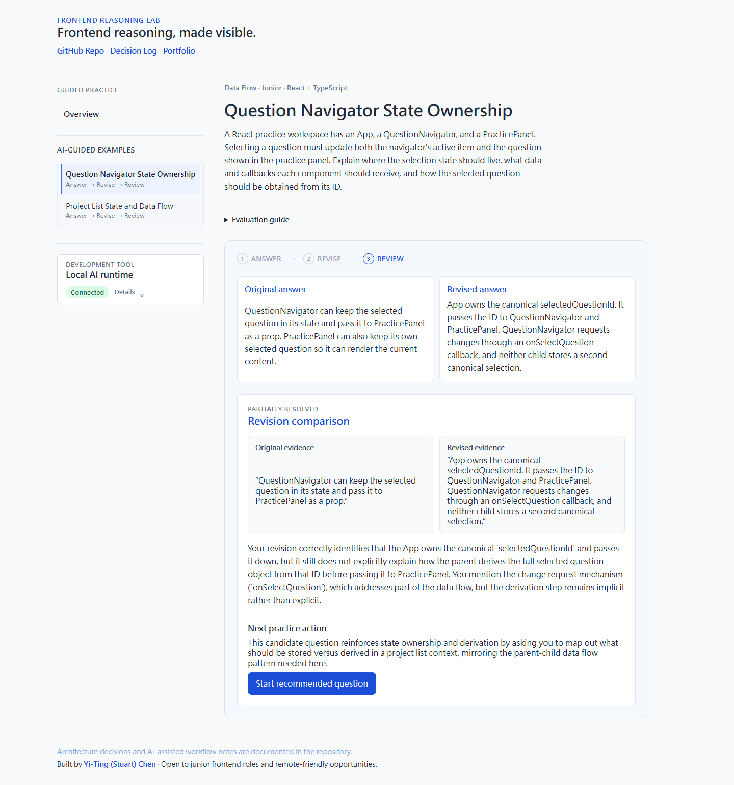
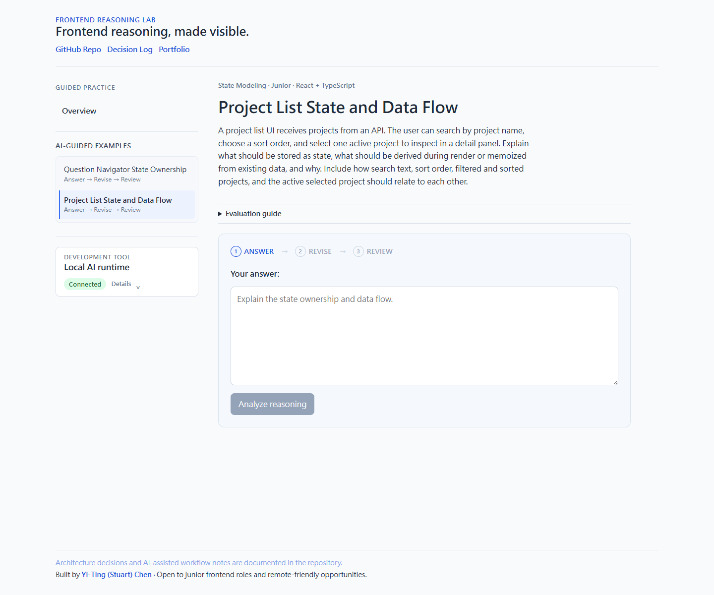

# FRL v3 Browser UI Evidence

## Purpose

This evidence set records one real local browser session through the complete
FRL v3 guided-practice path:

```txt
Answer
→ Revise
→ Review
→ Start recommended question
→ new Answer session
```

The captures prove the browser-visible workflow and its application-owned
transition to a validated recommendation. They do not change or redefine the
application, model, provider, prompt, or domain contracts.

## Evidence Index

All four screenshots were captured sequentially from the same model run, the
same browser context, and the same starting practice session.

### 1. Blank Answer phase



- **State:** `answering` on `react-state-ownership-01` — Question Navigator
  State Ownership.
- **User action:** Select the guided example before loading the demo answer.
- **Evidence:** The final guided-practice sidebar and selected state,
  question brief, collapsed Evaluation guide, shared Practice Panel surface,
  blank controlled answer editor, disabled Analyze action, and collapsed
  development-only Local AI runtime panel.

### 2. Diagnosis and revision



- **State:** `revising` after a validated `needs-follow-up` Call 1 result.
- **User action:** Load the reference demo answer and select
  `Analyze reasoning`.
- **Evidence:** One bounded `What to revise` diagnosis, exact submitted-answer
  evidence, `Why this matters`, one Focus question, the preserved original
  answer as the revision draft, and the Revise step as the active phase.

### 3. Revision comparison



- **State:** `complete / revision-reviewed`.
- **User action:** Load the reference improved answer and select
  `Review revision`.
- **Evidence:** Immutable original and revised answer snapshots, original and
  revised evidence, a `partially-resolved` semantic comparison, and one
  validated next action targeting `project-list-state-data-flow`.

### 4. Recommended question



- **State:** a new `answering` session on Project List State and Data Flow.
- **User action:** Select `Start recommended question` from the Review result.
- **Evidence:** The sidebar highlight moves to the recommended question,
  Answer becomes the active phase, the new controlled draft is blank, and no
  diagnosis or comparison result from the previous session remains visible.

## Final Run Record

| Field | Result |
| --- | --- |
| Capture date | 2026-07-29 |
| Branch | `feat/frl-v3` |
| Base revision | `d5489a0` |
| Starting question | `react-state-ownership-01` — Question Navigator State Ownership |
| Recommended question | `project-list-state-data-flow` — Project List State and Data Flow |
| Browser runtime | Local Netlify development runtime |
| Provider | Local LM Studio, development-only |
| Configured model | `qwen3.6-35b-a3b-uncensored-hauhaucs-aggressive` |
| Runtime status | HTTP 200; connected |
| Call 1 | HTTP 200; `needs-follow-up`; model latency 14,961 ms; browser-observed request 14,436 ms |
| Call 2 | HTTP 200; `partially-resolved`; model latency 15,427 ms; browser-observed request 16,913 ms |
| Call 2 next action | Present; recommended `project-list-state-data-flow` |

The provider and model identify the local development environment used for
this capture. They are not a production dependency claim and do not describe
the hosted application's runtime.

## Screenshot Method

- Browser viewport: 1440 × 1200 for every capture.
- Browser context, provider, model configuration, demo answer, and demo
  revision remained unchanged across the four images.
- Full-page capture was used consistently. The short Answer pages remained
  1440 × 1200; the content-driven Revise and Review pages extended to
  1440 × 1602 and 1440 × 1539 respectively.
- The runtime disclosure remained collapsed, so endpoint and model details are
  not exposed in the screenshots.
- The reference answers are purpose-written non-confidential demo content.
  No API key, token, credential, or private user data appears in the images.

## Feedback Voice

Visible Call 1 and Call 2 output addresses the user directly with `you`,
`your answer`, or `your revision`. The captured model output contains none of
`the learner`, `I think`, or `I believe`.

This is a presentation-policy observation from the final run, not a new schema
or semantic-validation claim.

## Browser and Session Validation

- Runtime status, Call 1, and Call 2 each returned HTTP 200.
- Call 1 entered Revise and Call 2 entered Review without a browser retry.
- Call 2 returned a contract-valid next action.
- Selecting the recommendation selected Project List State and Data Flow,
  started a new Answer session, cleared the controlled draft, and removed the
  previous Review result.
- No page exception, failed request, React console error, or actionable
  application console error was observed.
- Chrome emitted one generic 404 resource message; direct verification
  confirmed the existing missing resource was `/favicon.ico`.

## Claim Boundary and Limitations

This is local browser evidence against the repository's Netlify development
runtime and the configured loopback LM Studio provider. It does not prove a
hosted production browser E2E, production provider availability, public rate
limiting, failure/retry behavior, or every responsive breakpoint.

The static v2 question files and data remain in the repository for historical
and possible future use, but they are not exposed in the current v3 guided
practice UI.

## Source Revision

The screenshots were captured from the current uncommitted working tree based
on `d5489a0`, obtained with `git rev-parse --short HEAD` immediately before the
evidence run. The working tree also contained the uncommitted v3 UI, layout,
prompt-voice, presentation, and earlier evidence changes listed by
`git status`.

`d5489a0` is the base revision, not the SHA of a future evidence commit. No
placeholder or fabricated evidence-commit SHA is recorded here.
